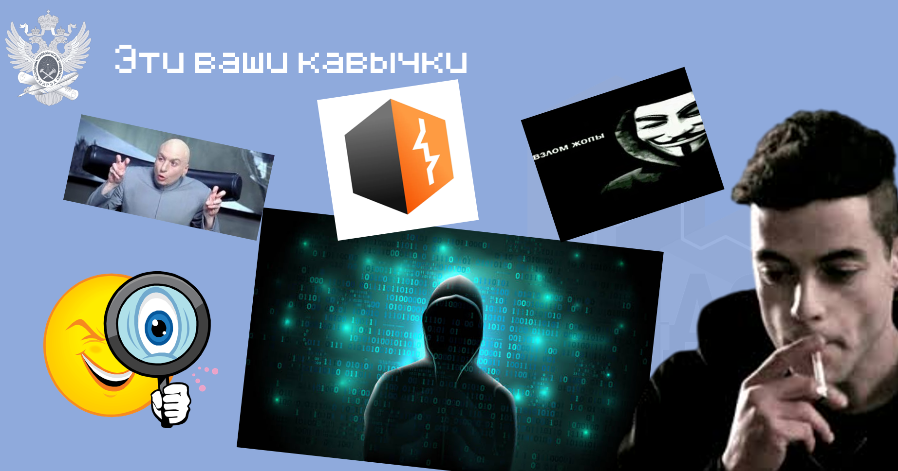

# mireactf-learn-web

Материалы для вокршопа по безопасности веба 13/12/2024

[Презенташка](./кавычки.pptx)

### Тасо4ки

| Название таска                                           | Описание                                                                              |
|----------------------------------------------------------|---------------------------------------------------------------------------------------|
| **[headers](tasks/headers/)**                            | Смотрим, как работает простое веб-приложение, и учимся с ним взаимодействовать        |
| **[senior-jwt-engineer](tasks/headers/)**                | Смотрим на устройство аутентификации и токенов, подделываем jwt                       |
| **[sql-hunter](tasks/sql-hunter/)**                      | Изучаем устройсто взаимодействия с базой данных через SQL, эксплуатируем простую SQLi |
| **[burger-storage](tasks/burger-storage/)**              | Пихаем ../                                                                            |
| **[pinger](tasks/pinger/)**                              | Пробуем эксплуатировать OS injection                                                  |
| **[pinger-delux-edition](tasks/pinger-deluxe-edition/)** | Тестим ревшеллы в блайнде                                                             |
| **[inspector-gadjet](tasks/inspector-gadjet/)**          | Превращаем Python Eval в RCE                                                          |
| **[web-sheriff](tasks/web-sheriff/)**                    | Пробираемся во внутреннюю сеть через SSRF                                             |

### Где качаться?

- Играйте цтфы - https://ctftime.org
- После цтфов читайте райтапы!!! Иногда это полезнее, чем сам цтф!!!
- Пробуйте читать и писать код - лучше всего ломает тот, кто хорошо умеет строить

- Наш сайтик с райтапами хороших тасков и статейками - https://mireactf.ru
- Port Swigger Academy - https://portswigger.net
- Hack The Box - https://www.hackthebox.com
- Try Hack Me - https://tryhackme.com

**[MireaCTF](https://t.me/mireactf)**